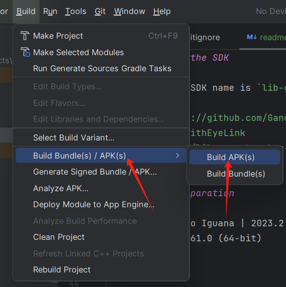
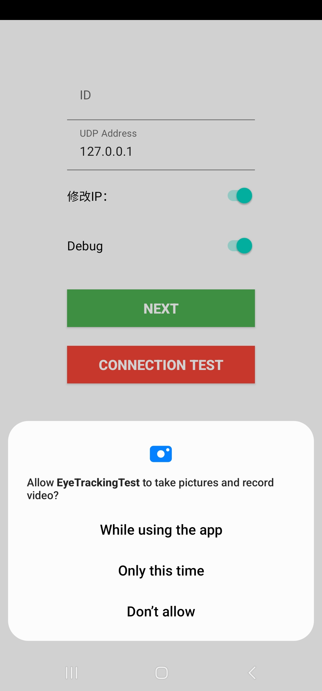
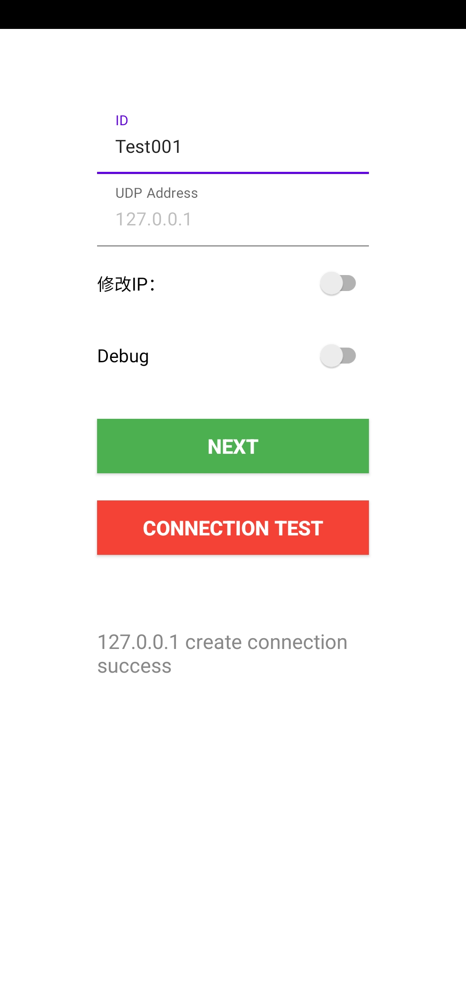

# Smartphone Eye Tracking Data Quality with EyeLink Weblink

## Smartphone Eye Tracking SDK

Please send an email to zhiguo@zju.edu.cn. Upon successful processing of your request, 
you will receive an email containing the Smartphone Eye Tracking SDK.

### Email Prompt

Here’s a template for your request email. Please keep the subject line unchanged:

```
Subject: Request for Access to the Smartphone Eye Tracking SDK

Dear Prof. Zhiguo Wang,

I hope this message finds you well.

My name is [Your Name], and I am a [student or researcher] at [Your Affiliation]. I am writing to request the Smartphone Eye Tracking SDK.

I assure you that I will use this SDK solely for academic and research purposes and will not utilize it for commercial activities or share it with others.

Thank you for considering my request. I look forward to receiving access to the SDK.

Best regards,
[Your Name]
```

### How to use the SDK

Given that the SDK name is `lib-gaze-tracker-release.aar`. Please use the following command to add the SDK to this project.
```
git clone https://github.com/GanchengZhu/DataQualityWithEyeLink
cd DataQualityWithEyeLink
mv {sdk folder}/lib-gaze-tracker-release.aar ./lib-gaze-tracker/
```

The SDK Documentation please refers to [this page](https://github.com/GanchengZhu/eye_tracking_data_quality_analysis/).


## Software Preparation

- Android Studio Iguana | 2023.2.1 Patch 1
- Weblink 2.2.161.0 (64-bit)

## How to install the App on the phone

Method 1: Direct Deployment via Android Studio

- Use USB debugging mode to deploy the app directly to your phone through Android Studio.
- For details, refer to the official guide: https://developer.android.com/studio/run.

Method 2: Build APK and Install Manually

- In the Android Studio menu bar, go to `Build` → `Build Bundle(s) / APK(s)` → `Build APK(s)`.

- Locate the generated APK file (usually in app/build/outputs/apk/debug/).
- Transfer the APK to your phone, open it in your file manager, and follow the prompts to install.

## How to conduct data quality experiment

- 1. Configure the smartphone and EyeLink Portable Duo according to the instructions in the paper. Open WebLink and set up the video capture card, corresponding calibration positions on the phone screen, and UDP port (recommended: 50880) following the EyeLink official documentation. The relevant code can be found in `app/src/main/java/org/gaze/eyetrackingtest/ReceiverUtil.java`.

- 2. Launch the App. Ensure all permissions are granted, including video recording, camera access, microphone access, etc.

     

- 3. Enter the participant ID (ID must consist of English letters A-Z, a-z, numbers 0-9, or underscores). Toggle the `修改IP` (Modify IP Address) switch to enable IP modification, then input the IP address of your WebLink Host PC. After entering, click `Connection Test` to verify communication between the smartphone and WebLink Host PC.  
     
     

- 4. Click "Next" to proceed to the instruction screen. The instruction reads:  
     `屏幕上会出现5个带有数字的圆圈，请按照指导人员的要求，依次注视它们。`  
     (English: "Five numbered circles will appear on the screen. Follow the experimenter's instructions to gaze at them sequentially.")  
     
     

- 5. When the participant understands the instructions, double-tap the screen to initiate Portable Duo calibration via WebLink. The experimenter should guide the participant to fixate on specific points based on instructions displayed on the EyeLink Host PC.  
     
     

- 6. After completing the EyeLink Portable Duo calibration, double-tap the screen again. A dialog box will appear. Instruct the participant to maintain fixation on the red dot inside the small circle.  
     
    

- 7. Click the `校准` (Calibration) button to enter the eye tracking calibration interface. Upon completion, a dialog will display the calibration results. If the error is below 0.75 cm, click the `验证` (Validation) button. Otherwise, re-calibrate by clicking `校准` (Calibration) again.

- 8. EyeLink gaze data is recorded during both calibration and validation phases. **Mobile eye tracking data is collected only during validation.**

- 9. All eye tracking data can be found in android local storage `/sdcard/Android/data/org.gaze.eyetrackingtest`.
For Android 11, you could not be allowed to access this folder. Please grant shell permission to MTManager(https://mt2.cn/) by
installing Shizuku (https://shizuku.rikka.app/) and activating it. 

- 10. For video demonstrations of experimental procedures, visit:  
     https://ganchengzhu.github.io/eye_tracking_data_quality_analysis/
